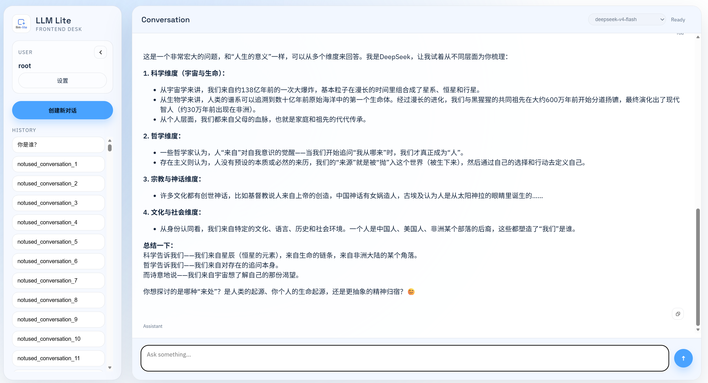

# llm-api-frontend-lite

LLM API 的轻量化前后端一体方案 —— 极简部署，开箱即用。

> 本仓库为 `lightest` 分支，追求最小资源占用与最简部署流程。主分支可能包含更多特性；若你只需要一个能跑、够用的 LLM 聊天下游，请使用本分支。

---

## 简要介绍



**llm-api-frontend-lite** 是一个面向 OpenAI 兼容 API 的轻量级聊天前端，由 **Go 后端** + **纯静态前端** 组成，代理层使用 **Node.js**。

- **后端 (Go)**：负责用户认证、会话管理、聊天历史持久化，并将客户端请求转发至上有的 OpenAI 兼容 API（支持流式 SSE 与非流式回退）。数据库使用嵌入式 **SQLite**，零外部依赖。
- **前端 (纯 HTML/CSS/JS)**：桌面端优先的聊天界面，支持 Markdown/LaTeX 渲染、会话历史管理、模型列表获取。不引入任何重型框架，保持极致轻量。
- **中间层 (Node.js)**：轻量静态文件服务器，同时作为 API 代理将前端请求转发至 Go 后端，支持 SSE 流式透传。

**核心特点**：零容器依赖即可运行、资源占用极低、代码简洁可读、适合个人或小团队快速部署私有 LLM 聊天服务。

---

## 部署方式

### 环境要求

- **Go** 1.21+
- **Node.js** 18+
- **npm** 9+

### 1. 克隆仓库并切换分支

```bash
git clone https://github.com/SoMeB0d1/llm-api-frontend-lite.git
cd llm-api-frontend-lite
git checkout lightest
```

### 2. 配置环境变量

将项目根目录下的 `.env.example` 复制为 `.env`，并填写配置：

```bash
cp .env.example .env
```

`.env` 文件内容说明：

| 变量 | 必填 | 说明 |
|------|------|------|
| `OPENAI_BASE_URL` | 是 | 上游 OpenAI 兼容 API 地址 |
| `OPENAI_API_KEY` | 是 | 上游 API 密钥 |
| `BACKEND_PORT` | 否 | Go 后端端口，默认 `8787` |
| `FRONTEND_PORT` | 否 | Node 前端端口，默认 `3000` |
| `TITLE_MODEL` | 否 | 用于生成会话标题的模型名，不填则不启用自动标题 |
| `ROOT_PSW` | 否 | root 用户的初始密码，不填则不创建 root 用户 |
| `LOG_PATH` | 否 | 日志输出路径，默认 `./log` |

### 3. 构建并运行

```bash
# 启动 Go 后端（端口 8787）
cd backend
go build -o server .
./server &

# 启动 Node 前端（端口 3000）
cd ../frontend
npm install
node server.js &
```

### 4. 访问

浏览器打开 `http://localhost:3000`，使用登录页进行认证（若配置了 `ROOT_PSW`，用户名 `root`）。登录后即可开始对话。

---

## 详细介绍

### 项目架构

```
┌─────────────────────────────────────────────────────┐
│                    用户浏览器                         │
│              http://localhost:3000                   │
└─────────────────────┬───────────────────────────────┘
                      │
                      ▼
┌─────────────────────────────────────────────────────┐
│           Node.js 前端服务器 (server.js)              │
│       端口: FRONTEND_PORT (默认 3000)                 │
│  · 静态文件服务 (HTML/CSS/JS)                         │
│  · API 代理转发 → Go 后端                             │
│  · SSE 流式透传                                      │
└─────────────────────┬───────────────────────────────┘
                      │
                      ▼
┌─────────────────────────────────────────────────────┐
│              Go 后端 (main.go)                       │
│       端口: BACKEND_PORT (默认 8787)                   │
│  · 用户认证 (用户名/密码 + Token)                     │
│  · 会话 & 消息管理 (SQLite)                           │
│  · 聊天处理 (SSE 流式 + 非流式回退)                    │
│  · OpenAI API 透明代理 (/v1/*)                        │
│  · 结构化 JSON 日志                                   │
└─────────────────────┬───────────────────────────────┘
                      │
                      ▼
┌─────────────────────────────────────────────────────┐
│          上游 OpenAI 兼容 API                        │
│         (OPENAI_BASE_URL)                           │
└─────────────────────────────────────────────────────┘
```

### 后端 API 一览

所有 API 均通过 Node 前端代理访问，实际处理由 Go 后端完成。

| 端点 | 方法 | 用途 | 请求体关键字段 |
|------|------|------|----------------|
| `/auth/login` | POST | 用户名密码登录，返回 Token | `user_name`, `user_psw` |
| `/auth/token` | POST | 校验 Token 有效性，过期自动刷新 | `token` |
| `/chat` | POST | 发送对话消息，支持 SSE 流式响应 | `userId`, `conversationId`, `model`, `message` |
| `/title` | POST | 调用模型自动生成会话标题 | `userId`, `conversationId` |
| `/history` | POST | 获取当前用户的所有会话列表 | `user_id` |
| `/history/topic` | POST | 获取指定会话的完整消息记录 | `conversation_id` |
| `/v1/*` | ALL | OpenAI API 透明代理（如 `/v1/models`） | 透传至上游 |
| `/health` | GET | 健康检查 | 无 |

> 完整的前后端 API 交互说明见 [frontend/api_README.md](frontend/api_README.md)。

### 前端组件结构

```
frontend/
├── index.html              # 主聊天页面
├── server.js               # Node.js 静态服务器 + API 代理
├── login/                  # 登录页面 (login.html + login.js)
├── token_check/            # Token 校验页面 (token_check.html + token_check.js)
├── src/
│   ├── app.js              # 聊天核心逻辑 (API 调用、消息渲染、会话管理)
│   └── ...                 # 其他前端模块
└── resources/              # 图标等静态资源
```

### 数据库说明

后端使用 **SQLite** 存储所有数据（文件位于 `backend/database.db`），包含以下表：

| 表名 | 用途 |
|------|------|
| `user` | 用户信息（ID、用户名、密码、Token、Token 时间） |
| `conversation` | 会话（ID、所属用户、标题、模型、System Prompt、最后编辑时间） |
| `message` | 消息记录（ID、所属会话、时间、角色、内容） |
| `files` | 文件引用（预留，当前未启用） |

**注意**：当前项目**不提供数据库编辑的 Web 界面或 API**。如需手动管理用户、修改会话标题或清理数据，请直接使用 SQLite 命令行工具操作：

```bash
cd backend
sqlite3 database.db
```

常用操作示例：

```sql
-- 查看所有用户
SELECT * FROM user;

-- 手动添加用户 (user_id 需在 0~63 范围内)
INSERT INTO user (user_id, user_name, user_password, user_token, token_time)
VALUES (1, 'alice', 'mypassword', 'aaaaaaaaaaaaaaaaaaaaaaaaaaaaaaaa', datetime('now'));

-- 查看某用户的会话列表
SELECT * FROM conversation WHERE user_id = 0;

-- 删除某条消息
DELETE FROM message WHERE message_id = 123;
```

详细数据库文档见 [backend/database_README.md](backend/database_README.md)。

### 项目文件速览

| 路径 | 说明 |
|------|------|
| `.env` / `.env.example` | 环境配置 |
| `backend/main.go` | Go 后端入口，路由注册 |
| `backend/login.go` | SQLite 数据库、用户认证与 Token 管理 |
| `backend/chat_handlers.go` | 聊天、标题生成（SSE + 非流式） |
| `backend/history.go` | 历史记录查询 |
| `backend/proxy.go` | `/v1/*` 透明反向代理 |
| `backend/logging.go` | 结构化 JSON 日志 |
| `backend/file_hash.go` | 文件哈希工具 |
| `frontend/server.js` | Node 静态服务器 + API 转发 |
| `frontend/src/app.js` | 前端聊天核心逻辑 |
| `frontend/login/` | 登录页面 |
| `frontend/token_check/` | Token 校验页面 |

### 技术细节

- **流式优先**：`/chat` 端点优先尝试 SSE 流式传输；若上游返回非流式响应或流失败，自动回退至 JSON 非流式模式。
- **Token 管理**：Token 为 32 位随机字符串，有效期 14 天。过期后自动刷新并返回新 Token。
- **会话复用**：会话 ID 池为 0~4095（共 4096 个槽位）。创建新会话时自动回收最旧的未使用槽位。
- **消息 ID 分配**：自动寻找最小可用 ID 间隙，避免 ID 浪费，上限 8388607。
- **CORS**：所有 API 端点均设置允许跨域访问。